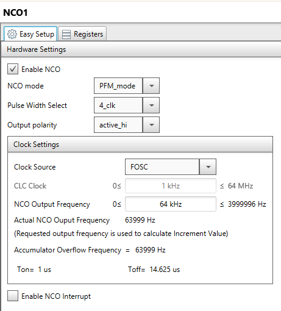
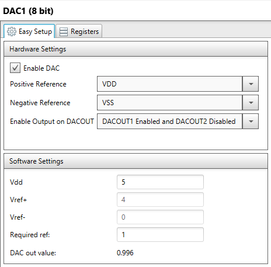
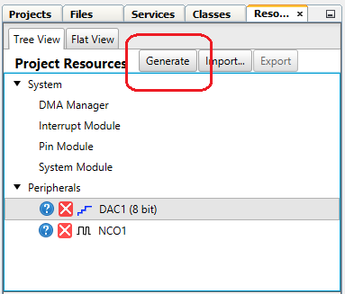

# Objective:
The “pic18f57q43-dma-2-dac” project highlights the use of the PIC18-Q43 family’s new DMA peripheral to create a state machine which drives an arbitrary waveform generator application. A table in GPR data memory contains the waveform values, the DMA peripheral transfers the data from the memory to the DAC, and the Numerically controlled oscillator (NCO) triggers the DMA transfer, setting the frequency of the waveform. The table contains 64 values for a complete sine wave with values between 0 and 255.

# Demo Configuration:
The Curiosity Nano Adapter Board (DM164150) is used in conjunction with the Curiosity Nano Base for Click Boards (AC164162) as the development platform. The Nano Base board has three MikroElektronika Click board slots, several types of power connections, voltage regulation circuitry, and a header mount for the Nano Development board. For this project the Nano Base board was used as a connection platform for connecting to the microcontroller via header pins.

### Curiosity Nano Development Board and Nano Base Board:


### Complete Project Setup:


# Project Software Configuration:
The project software was developed in MPLAB X with the help of the MPLAB Code Configurator (MCC) plug-in tool. The MCC tool provides a user-friendly interface that generates software based on the user’s parameters. MCC allows developers who may not be familiar with a new peripheral a way to quickly set up and test a peripheral without having to dive deep into the device datasheet. For this project, the MCC tool was used to generate code for the NCO, and DAC modules.  The DMA was configured in code for clarity

## NCO Configuration:
The NCO module was configured such that the output frequency is 64 kHz, which will generate a 1 kHz sinewave on the output. below.

### MCC NCO Editor Window:


```c
void NCO1_Initialize (void)
{
    // Set the NCO to the options selected in the GUI
    // EN disabled; POL active_hi; PFM PFM_mode;
    NCO1CON = 0x01;
    // CKS FOSC; PWS 4_clk;
    NCO1CLK = 0x40;
    NCO1ACCU = 0x00;
    NCO1ACCH = 0x00;
    NCO1ACCL = 0x00;
    NCO1INCU = 0x00;
    NCO1INCH = 0x41;
    NCO1INCL = 0x89;
    // Enable the NCO module
    NCO1CONbits.EN = 1;
}
```

## DAC Configuration:
The DAC module was configured to use the VDD and VSS rails as the positive and negative reference.  The output for DAC1 was also configured to drive port pin RA2. MCC’s CCP Editor window is used to select the DAC's references and to enable the output.

### MCC DAC Editor Window:


```c
void DAC1_Initialize(void)
{
    // OE DACOUT1 Enabled and DACOUT2 Disabled; DAC1EN enabled; NSS VSS; PSS VDD;
    DAC1CON = 0xA0;
    // DAC1R 51;
    DAC1DATL = 0x33;
}
```
## DMA1 Configuration:
The DMA1 peripheral is used to transfer the wave data from the array in GPR data memory, to the DAC1DATL register.  The timing of the transfer is regulated by the roll over frequency of the NCO.  Additionally, the priority of DMA1 is set to the highest priority to minimize the latency time between the NCO roll over and the output from the DAC.

### MCC DMA1 Editor Window:


```c
void DMA1_Initialize(void)
{
    //DMA Instance Selection : 0x00
    DMASELECT = 0x00;
    //Source Address : swave
    DMAnSSA = &swave;
    //Destination Address : &DAC1DATL
    DMAnDSA = &DAC1DATL;
    //DMODE unchanged; DSTP not cleared; SMR GPR; SMODE incremented; SSTP not cleared;
    DMAnCON1 = 0x02;
    //Source Message Size : 64
    DMAnSSZ = 64;
    //Destination Message Size : 1
    DMAnDSZ = 1;
    //Start Trigger : SIRQ NCO1;
    DMAnSIRQ = 0x33;
    //Abort Trigger : AIRQ None;
    DMAnAIRQ = 0x00;

    // Clear Destination Count Interrupt Flag bit
    PIR2bits.DMA1DCNTIF = 0;
    // Clear Source Count Interrupt Flag bit
    PIR2bits.DMA1SCNTIF = 0;
    // Clear Abort Interrupt Flag bit
    PIR2bits.DMA1AIF = 0;
    // Clear Overrun Interrupt Flag bit
    PIR2bits.DMA1ORIF =0;

    PIE2bits.DMA1DCNTIE = 0;
    PIE2bits.DMA1SCNTIE = 0;
    PIE2bits.DMA1AIE = 0;
    PIE2bits.DMA1ORIE = 0;

    //EN enabled; SIRQEN enabled; DGO not in progress; AIRQEN disabled;
    DMAnCON0 = 0xC0;

}
```

## Wave data table array:
The data table for the waveform generator is an uint8_t array of 64 elements.  Each element is preloaded with the appropriate wave value.

```c
// wavefile for sine wave
extern uint8_t swave[64] = {0x8C, 0x99, 0xA5, 0xB1, 0xBC, 0xC7, 0xD1, 0xDA, 0xE2, 0xEA,
                            0xF0, 0xF5, 0xFA, 0xFD, 0xFE, 0xFF, 0xFE, 0xFD, 0xFA, 0xF5,
                            0xF0, 0xEA, 0xE2, 0xDA, 0xD1, 0xC7, 0xBC, 0xB1, 0xA5, 0x99,
                            0x8C, 0x80, 0x74, 0x67, 0x5B, 0x4F, 0x44, 0x39, 0x2F, 0x26,
                            0x1E, 0x16, 0x10, 0x0B, 0x06, 0x03, 0x02, 0x01, 0x02, 0x03,
                            0x06, 0x0B, 0x10, 0x16, 0x1E, 0x26, 0x2F, 0x39, 0x44, 0x4F,
                            0x5B, 0x67, 0x74, 0x80};
```

## System Configuration and Main function:
MCC can be used to configure basic system parameters, such as oscillator selection and I/O pin configuration.
Once all project parameters have been configured, simply press the ‘Generate’ button, and MCC will generate the drivers based on user inputs.
In the main function, note the command "DMA1_SetDMAPriority(0)", this function sets the DMA priority in the system arbiter to 0 or highest priority.  
```c
void main(void)
{
    SYSTEM_Initialize();
    DMA1_SetDMAPriority(0);
    while (1)
    {
    }
}
```


### Generate Button:


### Hardware Connections:


# Conclusion:
The ‘pic18f57q43-dma-2-dac.x’ project uses the PIC18F57Q43 microcontroller’s NCO, DAC, and DMA modules to create a waveform generator that operates completely without firmware overhead.  The statemachine design is based on using the source address counter in the DMA as the state latch, increment the statemachine from 0-63 and then rolling over.  During each state, the DMA module transfers an appropriate value from the wave data table to the DAC.

### Waveform output:

